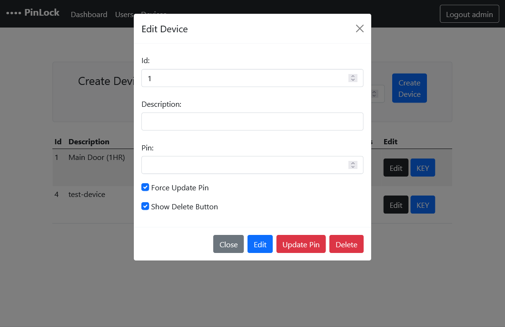

# Web service
The web service contains the authentication, authorization and admin controll for one or more Pinlock device. It's build on top of ASP.NET core framwork and sqlite. The communication protocol is HTTPS; for the communicating with the pinlock it uses REST API with APIKEY for authentication. For admin and user access it uses web served app and Identity as the authentication protocol.

---

## Roles:
* **ADMIN** 
    1. Has login credential.
    2. Can create and delete **USER**.
    3. Can access and change the current PIN.
    4. Can register and invoke a **DEVICE**.
    5. Can see the log of a specific **DEVICE**.
    
* **USER**
    1. Has login credential.
    2. Can see the **PIN** and **DEVICES**.

* **DEVICE**
    1. Has APIKEY.
    2. Can get the code.

## Functionalty:

* ### API Endpoints:


    **1.** Check the pincode:
        Throw the Endpoint `/api/lock` a code/pin can be checked if it's valid.
        Requires an `apikey` and `pin`
        Returns a boolan `"authorized"` as well as the current pin for caching. 

    Example Request:
    ```http
    https://pinlock.nor.nu/api/lock?
        pin=1234
        &apikey=930238a3-8e50-402a-97cc-415bb223ae99
    ```
    Example Respone:
    ```json
    {
        "authorized": false,
        "currentPin": "2706",
        "expire": "2022-01-05T15:21:14.524837Z",
        "errors": null
    }
    ```
    **2.** Heartbeat endpoint: accepts an `apikey` throw a HTTP GET request and returns nothing.
    This endpoint should be called by the device at least once every 5 minutes and it's used to indicate the status of the device on the admin's dashboard.
    
    Example Request:

    ```http
    https://pinlock.nor.nu/api/lock/beat? 
        apiKey=930238a3-8e50-402a-97cc-415bb223ae99
    ```

    ---
* ## Web-Interface:

    ### **Administrator:**
    - User Creation: Create and Delete an user.
    
    >The username should not include spaces and the password should be at least 8 character and includes one of the following: a number, small and capital letter and a special symbol.
    
    - Device registration: 
    Create Device with a device description _e.g. Main Entrance_ and a default pin expire which is how long the pin changes automatically _e.g. 24_ or for the pin to change everytime is used the value should be _0_

    - Device Management:
    Edit description, update pin _(Sets the next pin)_, force update pin _(Changes the current pin)_ and Delete the device. An Adminstrator can also get the `apikey` for a specific device and check the status of the devices.
    > If forcing a pin update should be avoided if the device does not have a stable connection to the internet, in case of a disconnection before the new pin is used, the cached pin on the device will not be the same as the current pin.

    ### **User:**
    - Check all the devices and the current pin for each device.

    ---
* ## Screenshots:

<details>
  <summary><b>Login</b></summary>
  <markdown>
            
  </markdown>
</details>

<details>
  <summary><b>Admin Dashboard</b></summary>
    <details>
        <summary>Create User</summary>
        <markdown>
        
        </markdown>
    </details>
    <details>
        <summary>   Create Device</summary>
        <markdown>
                    
        </markdown>
    </details>
    <details>
        <summary>Device Edit</summary>
        <markdown>
            
            
            
        </markdown>
    </details>
</details>

<details>
  <summary><b>User Dashboard</b></summary>
  <markdown>
  
  </markdown>
</details>
